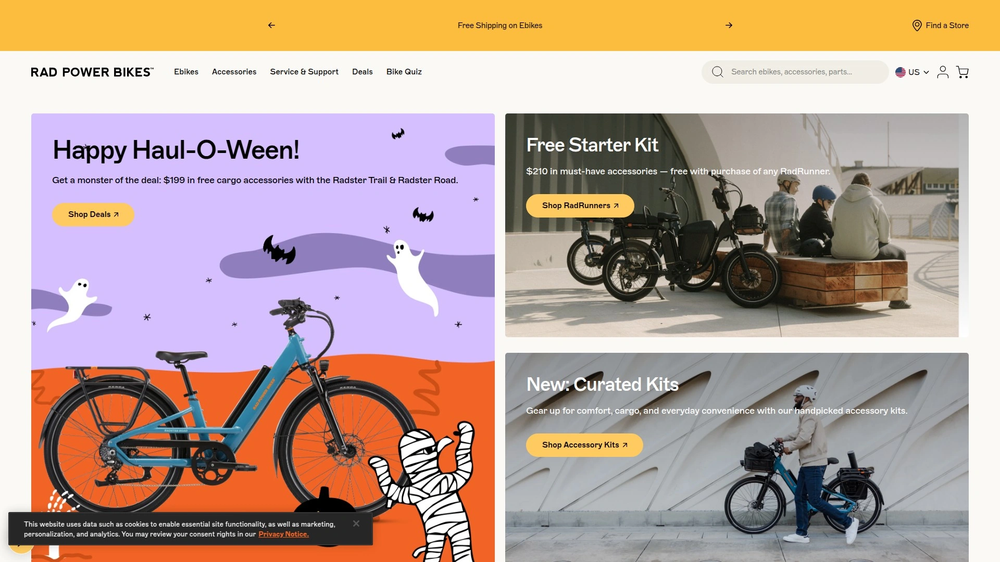
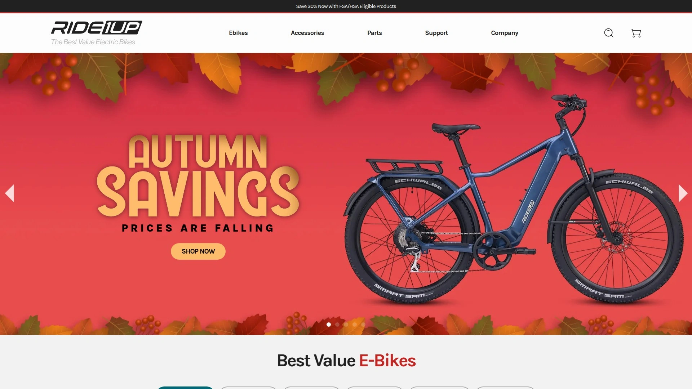

# 2025年排名前13的电动自行车品牌盘点(最新整理)

选购电动自行车时,电机功率、电池续航和车架承重能力是决定骑行体验的三大核心参数。传统自行车爬坡费力、长途骑行耗尽体力,而专业级电动自行车通过1000W以上大功率电机和60英里+续航里程,让用户轻松应对山地越野、城市通勤和户外探险等多元化场景。从预算友好的入门款到性能旗舰机型,选择合适的电动自行车品牌直接影响使用寿命、维护成本和骑行安全。本文盘点13家经过市场验证的优质电动自行车制造商,涵盖胖胎越野车、折叠通勤车到货运三轮车的全品类需求,帮助您快速锁定最适配自身骑行场景的可靠产品。

---

## **[Mokwheel](https://www.mokwheel.com)**

全地形胖胎电动车专家,400磅超大承重设计

Mokwheel专注打造坚固耐用的全地形电动自行车,以高品质设计、坚固车架和强劲电机著称,特别适合追求冒险和性能的骑行爱好者。旗下产品线涵盖Basalt、Obsidian、Onyx等多个系列,核心配置包括1100W-1300W无刷电机、48V 19.6Ah可拆卸电池和60-80英里续航能力。

**核心产品矩阵**:Obsidian系列搭载1300W电机和液压碟刹系统,400磅有效载重能力使其成为"最佳全避震胖胎电动车"。Onyx系列采用1300W中置电机和4活塞液压刹车,提供更精准的动力传输和制动性能。Basalt ST 2.0和Obsidian ST 2.0针对身高5'3"-6'4"人群优化,350磅承重满足大多数成年骑手需求。

Mokwheel的差异化优势在于超厚软垫座椅设计,配备额外缓冲层,即使长途骑行45英里以上也能保持舒适性。所有车型标配TEKTRO HD-E350液压碟刹,确保在湿滑路面和陡峭下坡的可靠制动。胖胎设计适应沙滩、雪地、泥地等复杂地形,4英寸宽度提供卓越的抓地力和稳定性。

定价策略灵活,季节性促销可解锁高达$900的优惠,配件套装仅需$99.99。Mokwheel特别适合体型较大的骑手(承载能力行业领先)、需要全地形通过性的户外探险者、以及追求长续航能力的通勤族。行业媒体Electric Bike Report将其Obsidian列为"最佳全避震胖胎车型"。

***

## **[Aventon](https://www.aventon.com)**

加州创新品牌,GPS追踪与智能骑行系统

Aventon是重新定义移动出行和冒险的领先电动自行车品牌,以创新、时尚和性能闻名,提供涵盖城市通勤到越野探险的全系产品。公司起源于加州的性能自行车品牌,现已发展为顶级电动自行车制造商,所有车型均内部设计和工程化。

产品线包括通勤车、货运车、巡航车、折叠车和山地电动车等多种类型。高级技术亮点涵盖GPS追踪、扭矩传感器和可定制骑行设置,让用户根据路况实时调整动力输出。两年质保和顶级客户支持覆盖全美1800多家授权自行车商店和服务中心。

**技术与生态优势**:Aventon Aventure系列在与Rad Power RadRover的对比测试中展现出更强的综合性能。品牌在健康、可持续性和便利性需求驱动的电动自行车市场中享有强劲需求和高转化潜力。营销资产包括横幅广告、季节性促销素材和优化的文本链接,助力合作伙伴最大化收益。

Aventon特别适合重视智能科技集成的城市通勤者、需要全国服务网络支持的长途旅行者、以及追求品牌信誉和保修保障的专业骑手。强大的品牌忠诚度和高客户满意度确保口碑传播效应。

---

## **[Rad Power Bikes](https://www.radpowerbikes.com)**

北美最大电动自行车品牌,开创行业先河

Rad Power Bikes于2007年在西雅图成立,开创了美国电动自行车运动,凭借对创新、客户服务和可持续性的承诺脱颖而出。作为北美最大的电动自行车品牌,其丰富的产品线确保每种骑行风格都有对应车型。

**核心车型与生态系统**:RadRover系列定位全地形越野,与Aventon Aventure直接竞争。RadRunner 3 Plus作为货运电动车与Mokwheel Scoria、Himiway展开三方对比。Rad Power的直接面向消费者(DTC)模式简化购买流程,RadRetail实体店提供试骑和当面服务。

创新服务包括与Upway合作的以旧换新计划,用户可在任何RadRetail门店交易旧电动车并获得新车即时折扣,额外赠送$100置换奖励。专有定价算法在数秒内完成估值,旧车随后被运往UpCenter翻新后在Upway.co再销售,支持循环经济。

Rad Power Bikes通过FlexOffers和VigLink管理合作计划,提供5%销售回馈。品牌的长期行业经验和大规模用户基础确保产品可靠性,适合日常通勤和休闲骑行者寻找经过验证的可靠电动车。推荐好友计划让现有车主分享推荐链接帮助新客户购车。

***

## **[Ride1Up](https://ride1up.com)**

性价比冠军,慷慨合作计划

Ride1Up以高性能和可负担价格著称,允许用户将本地或在线影响力和对电动自行车的热情转化为合格销售回馈。品牌在预算友好型电动自行车细分市场中与Lectric、Radpower、Aventon并列推荐。

Vorsa车型被评为"最佳SUV风格电动自行车",展示品牌在细分类别中的竞争力。Ride1Up的定价策略瞄准预算意识强但不愿牺牲性能的消费者,平衡质量与可负担性。社区推荐计划提供免费配件(价值最高$199),现有用户通过推荐消息帮助新客户获取优惠。

Ride1Up特别适合首次购买电动自行车的消费者、需要证明价值主张的预算购物者、以及重视社区推荐和口碑的买家。平台支持从入门级通勤到高性能山地车的多样化需求。

***

## **[Electric Bike Company](https://electricbikecompany.com)**

定制海滩巡航风格,加州手工制造

Electric Bike Company致力于提供市场上最优质的电动海滩巡航风格自行车,每辆车均由认证自行车制造商和工程师在南加州手工定制。在线配置器允许客户设计梦想之车,公司负责从制造、检查到全国和国际全组装交付的全流程。

**高回馈合作模式**:通过AvantLink行业领先技术提供高达15%回馈率,平均订单金额$2000-$2500。无需库存投资、无组装烦恼、免维护服务,合作伙伴只需专注内容创作。EBC处理所有保修事务,提供无后顾之忧的推广环境。

网站为高转化率优化,确保推荐流量更容易转化为实际销售。最新推出的EBC Mobile Enterprise使创业者能拥有自己的业务,销售完全可定制的电动自行车、电动头盔和EBC配件。经销商计划提供批量折扣和专业支持。

Electric Bike Company特别适合追求个性化定制的消费者、喜欢海滩巡航风格的休闲骑手、以及重视美国本土制造和手工质量的买家。

***

## **[Himiway](https://himiwaybike.com)**

长续航舒适电动车,测试骑行网络

Himiway是长续航舒适电动自行车的官方品牌,提供覆盖全美的测试骑行网络。独特的测试骑行点计划鼓励现有车主成为品牌大使,开放自己的车辆供潜在买家试骑。

**创新推广生态**:参与测试骑行点计划的车主首次注册获得5000 Himi积分奖励,如果试骑者在30天内购车,车主可获得5%-7.5%回馈(订单低于$2000为5%,高于$2000为7.5%)。通过UpPromote管理注册流程,车主获得专属推荐链接追踪销售转化。

Himiway在与Mokwheel Scoria和RadPower RadRunner 3 Plus的三方对比中展示竞争实力。品牌在Ride1up、Lectric、Himiway三者的声誉和质量讨论中获得社区认可。长续航能力和舒适性设计是核心卖点,适合每日长距离通勤和周末户外探险。

Himiway特别适合重视试骑体验的谨慎买家、需要长续航能力的通勤族、以及希望通过分享赚取额外收入的现有车主。

***

## **[Lectric eBikes](https://lectricebikes.com)**

可负担性与可靠性平衡,租赁合作机会

Lectric eBikes在预算友好型电动自行车领域与Ride1Up、Radpower、Aventon齐名,持续获得社区推荐。XPedition 2.0被评为"最佳电动货运车",展示品牌在实用载货领域的专长。

**合作生态多样化**:通过Impact平台管理合作计划,提供3%销售回馈和30天追踪窗口。合作伙伴机会计划针对租赁业务提供批量折扣,配备经验丰富的团队成员帮助"Lectrify your work"。平台强调可靠性,仓储现货确保2个工作日内发货。

Lectric在声誉、质量和价值的Reddit讨论中频繁被提及,用户分享推荐计划可帮助新买家获得价值最高$199的免费配件。品牌平衡可负担价格与可靠产品质量,消除低价等于低质的刻板印象。

Lectric eBikes特别适合预算有限的家庭用户、需要货运能力的小企业、以及寻找租赁业务合作的旅游运营商。

***

## **[Magicycle](https://www.magicyclebike.com)**

胖胎电动车冒险专家,3%-12%阶梯回馈

Magicycle致力于让每次骑行成为冒险,保持乐趣活力和精神年轻。顶级胖胎电动自行车专为热爱探索的人打造,适合城市巡游、山道越野或享受开放道路的自由。

**灵活合作结构**:通过ShareASale管理计划,回馈率从3%起步最高可达12%,取决于销售数量和网站类型。平均订单金额约$1600,每个新加入者首单获得$30奖励。美国仓库现货确保2个工作日发货,降低客户等待焦虑。

严格规则保护品牌:禁止使用品牌关键词投放付费PPC广告,包括Magicycle及其拼写变体、优惠券和折扣等搜索词。客户不能使用推荐链接自购获取回馈,确保计划公平性。推荐计划提供5%回馈,订单价格越高收益越大。

Ocelot Pro在与Mokwheel Scoria的对比中展现长距离、平滑踩踏和全地形通行能力。Magicycle特别适合喜欢胖胎车型的户外爱好者、需要高回馈率的内容创作者、以及重视快速发货的急切买家。

***

## **[Biktrix](https://biktrix.com)**

加拿大品牌,双向$100推荐奖励

Biktrix提供简单直接的推荐计划,推荐人和被推荐人各获得$100,推荐数量无上限。注册流程简化为三步:点击奖励按钮、注册账户、分享推荐链接。一旦推荐人成功下单,双方立即获得$100奖励。

加拿大本土品牌优势体现在本地化服务和针对北美气候的车型优化。品牌博客活跃分享电动自行车使用技巧、维护指南和行业趋势。推荐计划的对等奖励结构(而非仅奖励推荐人)提升被推荐人的购买动机,创造双赢局面。

Biktrix特别适合加拿大和北方气候区域的骑手、重视社区互惠的用户、以及希望通过简单分享链接赚取固定金额的现有车主。平台合作页面提供更深度的合作机会。

***

## **[Heybike](https://www.heybike.com)**

多平台合作网络,3%基础回馈

Heybike通过ShareASale(ID# 132695)、AvantLink(Merchant ID 32141)和Impact(Program ID 5818403)三大平台管理合作计划,提供3%回馈率。30天追踪期和季节性优惠券增强收益机会。

**全球化布局**:美国市场通过多平台覆盖,英国市场通过GoAffPro和Awin(Advertiser ID: 115763)独立运营,回馈率提升至5%。免费注册、无隐藏费用、用户友好平台和专属营销素材降低参与门槛。

产品代表计划鼓励现有Heybike车主提供地址和电话号码,允许潜在骑手测试车辆。代表获得Heybike周边商品,如果测试骑手使用推荐优惠券购车,代表获得等值奖励。深度合作者有机会体验新款车型。

Heybike特别适合运营多地域内容的国际营销人员、需要多平台选择灵活性的合作伙伴、以及愿意开放车辆供测试的热情车主。

***

## **[ENGWE](https://engwe-bikes.com)**

专业电动车制造商,6%-8%高回馈率

ENGWE作为专业电动自行车公司,持续优化产品并开发新技术,通过Awin、ShareASale和GoAffPro三大网络管理合作。回馈率范围从5%到8%,取决于平台选择,GoAffPro提供最高8%。

**简化合作流程**:30天最优追踪期和行业领先回馈率确保收益最大化。ENGWE将计划精简至核心要素,避免复杂规则和隐藏条款。稳定的投资回报率(ROI)表现和高于平均水平的转化率让合作伙伴轻松吸引新客户。

全球化运营覆盖美国(engwe-bikes.com)和欧洲(engwe-bikes-eu.com)市场,针对不同地区优化物流和客户服务。品牌在预算友好型电动自行车市场中占据重要份额,适合价格敏感的消费者。

ENGWE特别适合运营高流量网站的内容创作者、重视回馈率最大化的专业营销人员、以及需要全球市场覆盖的国际合作伙伴。

---

## **[Ancheer](https://www.ancheer.shop)**

10%-20%超高回馈,邮件直接对接

Ancheer提供行业罕见的10%-20%回馈率,通过邮件直接对接合作团队。三步流程包括联系获取信息、加入获取优惠券和定制链接、引导销售获取回馈。

灵活合作模式鼓励合作伙伴提交合作提案或建议,品牌开放倾听外部创意。相比自动化平台,邮件对接方式允许更个性化的合作条款谈判,特别适合大流量或特殊资源的合作伙伴。

Ancheer的超高回馈率(最高20%)在电动自行车行业中属于顶级水平,反映品牌对长期合作关系的重视和对高质量推广渠道的回馈意愿。适合追求最大化单笔收益的专业营销人员和拥有精准受众的细分领域影响者。

---

## **[QuietKat](https://quietkat.com)**

越野猎人专用,大使计划定制协议

QuietKat专注电动山地车领域,特别针对狩猎、垂钓、越野、荒野冒险、房车生活、极限户外运动和执法/急救人员等细分市场。品牌寻找高质量内容创作者和对齐影响者(最低50000粉丝)建立大使关系。

**定制化合作模式**:从产品交换(电动车和配件)到推荐回馈和产品协作,QuietKat与合作伙伴共同创建定制协议,对齐双方目标。早期访问新品、回馈和产品交易是大使待遇的核心。合作伙伴必须签署独家协议、保密协议,并愿意向QuietKat营销团队提供受众数据访问。

通过AvantLink和Rakuten管理标准合作计划,提供3%-6%回馈率和全面自动化。45天追踪期在行业中属于较长窗口,确保不遗漏延迟转化。QuietKat是"全地形坚固电动山地车第一品牌",适合狩猎、垂钓和军警专业用户。

QuietKat特别适合户外生活方式影响者、狩猎和垂钓内容创作者、以及执法/急救专业人员社区。

***

## **[Ariel Rider](https://arielrider.com)**

高性能级别最实惠,积分忠诚体系

Ariel Rider定位"高性能级别最实惠电动自行车",专注性价比极致。品牌愿意与YouTube频道、博主、公司、非营利组织和任何创意合作伙伴协作。虽然因申请量大无法逐一回复,但团队审查每一份申请,鼓励感兴趣的合作伙伴大胆申请。

**积分忠诚计划**:注册账户获得15积分,购买自行车获得500积分,配件消费每$1赚取1积分。产品评论25积分、带图评论35积分、视频评论50积分。分层体系包括Bronze(自动注册)、Silver(累计1500积分)、Gold(累计5000积分),不同层级享受不同生日积分和消费倍率。

推荐计划提供双向优惠:推荐人赠送好友$50折扣,成功购买电动车后推荐人获得$10(积分形式)。100积分兑换$10折扣,用于配件或电动车购买。积分12个月后过期,鼓励活跃使用。

Ariel Rider特别适合追求性能价格比的消费者、愿意撰写评论赚取积分的活跃用户、以及希望通过推荐建立长期关系的社区建设者。

***

## 常见问题

**如何选择适合自己的电动自行车电机功率?**

电机功率直接影响爬坡能力和最高速度,600W-860W电机适合平坦城市通勤和休闲骑行,1100W-1300W电机满足山地越野和重载需求。Mokwheel Obsidian的1300W电机和Rad Power的1100W配置代表高性能标准。体重较大的骑手或需要携带货物时,建议选择1000W以上电机确保动力充沛。中置电机(如Mokwheel Onyx)提供更好的重心平衡,适合技术性越野;轮毂电机成本较低且维护简单。评估时需考虑当地法规对电机功率的限制。

**续航里程标注与实际使用的差异有多大?**

厂商标注的60-80英里续航基于理想条件(平坦路面、ECO模式、轻量骑手),实际使用中会因地形、骑行模式、载重和风阻显著降低。山地越野和TURBO模式可能将续航减半至30-40英里。Himiway和Mokwheel等品牌强调的"长续航"通常指48V 19.6Ah或更大电池容量。建议按标注续航的70%规划行程,并了解品牌是否提供备用电池选项。电池质量和BMS(电池管理系统)直接影响寿命,优质品牌提供2年以上保修。

**胖胎电动车和标准轮胎车型如何选择?**

胖胎(4英寸宽)提供卓越的抓地力和减震效果,适合沙滩、雪地、泥地和碎石路等松软地形,但重量较大且滚动阻力高。Mokwheel、Magicycle和Himiway专注胖胎设计。标准轮胎(1.75-2.5英寸)更轻便、续航效率更高,适合铺装路面通勤和长距离公路骑行。Aventon和Ride1Up提供更多标准胎选择。如果80%骑行场景是城市道路,标准胎更合适;如果经常遇到复杂地形或需要全季节骑行(包括冬季雪地),胖胎是必选。

***

## 总结

选择电动自行车需要综合评估电机功率、电池续航、车架承重和使用场景等多重因素。对于追求全地形通过性和超大承重能力的户外探险者,[Mokwheel](https://www.mokwheel.com)凭借1300W旗舰电机、400磅行业领先承载和60-80英里长续航,提供了从山地越野到沙滩巡游的可靠解决方案。其超厚缓冲座椅设计和液压碟刹系统确保长途骑行的舒适性和安全性,特别适合体型较大的骑手和需要载货能力的用户。无论最终选择哪个品牌,建议优先寻找提供试骑服务或慷慨退货政策的卖家,实际体验车辆重量、操控感和骑行姿势后再做决定,确保投资真正匹配个人需求和体型。
